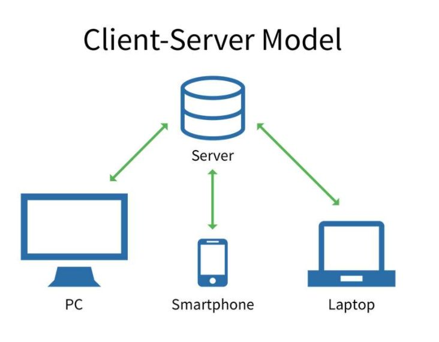

**本镜像实现的是固定翼无人机的路径规划功能，基于[XTDrone](https://www.yuque.com/xtdrone/manual_cn "XTDrone")框架,在已知全局地图情况下使用[混合A*算法](https://github.com/zm0612/Hybrid_A_Star "混合A*算法")完成路径规划,发送至[Autopilot开源飞控系统](https://px4.io/ "Autopilot")执行。**

## 使用Docker部署仿真环境

由于仿真环境的配置需要安装很多库，对于新手不太友好，因此提供了Docker镜像(此镜像基于xtdrne:1.3镜像，环境部署见[这里](https://www.yuque.com/xtdrone/manual_cn/docker "xtdrone镜像部署"))，便于使用。

>主机上只需安装 Nvidia 驱动，CUDA 已经包含在了 NVIDIA-Docker 中。

>不推荐在Windows中配置镜像
>
>1、Windows不支持图像界面服务X11，需要额外安装[VcXsrv](https://sourceforge.net/projects/vcxsrv/ "VcXsrv")来启动X11Server，通过SSH连接到容器，启动X11 forwarding功能才能显示图形界面。
>
>2、WSL本身并不支持连接 USB 设备，不能调用部分外设，因此你需要安装开源 usbipd-win 项目。详见[连接USB设备](https://learn.microsoft.com/zh-cn/windows/wsl/connect-usb "连接USB设备")

#### 下载镜像，导入镜像(链接：[](),密码：)

```
sudo docker load -i xtdrone_1_3.rar
```

#### 查看看镜像

```
sudo docker image ls
```

## 启动镜像

### 仿真环境

#### 本地更改X11 server访问控制。显示图形界面

linux目前的主流图像界面服务X11又支持客户端/服务端（Client/Server）的工作模式



```
xhost +
```
#### 启动镜像
```
sudo docker run --runtime=nvidia --rm -it -v /tmp/.X11-unix:/tmp/.X11-unix -e DISPLAY -e XAUTHORITY -e NVIDIA_DRIVER_CAPABILITIES=all xtdrone/ssh:1.3
```
> -v /tmp/.x11-unix:/tmp/.x11-unix #共享本地unix端口 共享本地套接字通信
> 
> -e DISPLAY=unix$DISPLAY #修改环境变量DISPLAY

#### 启动仿真程序
```
roslaunch px4 tianyuan_plane_0.launch
```

启动通信脚本：0表示0号固定翼
```
cd ~/XTDrone/communication/ 
python plane_communication.py 0
```

启动键盘控制脚本：1表示一架固定翼
```
cd ~/XTDrone/control/keyboard
python plane_keyboard_control.py 1
```

推荐起飞流程：v起飞->t解锁->先设置航点位置然后o载入航点->s盘旋->b切换offboard模式

启动混合A*算法和接口程序

```
roslaunch hybrid_a_star run_hybrid_a_star.launch
```
```
roslaunch hybrid_a_star init_pose.launch namespace:=/plane_0
```
```
roslaunch hybrid_a_star path_hd.launch namespace:=/plane_0
```

### 实际飞行

启动mavros连接到飞控

```
roslaunch mavros apm.launch fcu_url:="/dev/ttyUSB0:波特率" #使用px4飞控则运行px4.launch
```

启动混合A*算法和接口程序

```
roslaunch hybrid_a_star run_hybrid_a_star.launch
```
```
roslaunch hybrid_a_star init_pose.launch
```
```
roslaunch hybrid_a_star path_hd.launch firmware:=apm #使用px4飞控则firmware:=px4 默认是px4
```
## 其他

### Tmux

> 在linux系统中，一个bash窗口程序是窗口中执行的程序的父进程，负责管理其中执行的程序，如果关闭当前bash窗口，则会发送一个中断信号终止其子进程。因此使用Tmux管理进程。

Tmux 是一个终端复用器（terminal multiplexer）,Tmux 就是会话与窗口的"解绑"工具，将它们彻底分离。

#### 基本用法
```
tmux # 进入Tmux窗口

Ctrl+b c # 创建会话
Ctrl+b x # 结束会话
Ctrl+b 0~9 # 切换会话
```

### 换源
> 镜像中使用的是清华源
```
# sudo cp /etc/apt/sources.list /etc/apt/sources.list.bak #备份

rm /etc/apt/sources.list
mv /etc/apt/sources.list.backup /etc/apt/sources.list

apt update #更新信息
apt upgrade #升级包
```

### 清华源连接不上的问题

原因在于DNS服务解析异常，解决的方法也很简单，只需要修改/etc/docker/daemon.json加入如下内容即可（如果没有这个文件则创建之）

```
{                                                                          
    "dns": ["8.8.8.8", "114.114.114.114"]                                                                           
} 
```
最后重启docker服务，系统即可正常解析镜像网站并运行

```
systemctl restart docker
```

### 容器安装ssh，更改配置文件
> 镜像中配置了ssh，需要自行启动
```
apt-get install openssh-server
vi /etc/ssh/sshd_config

# 改动内容
PermitRootLogin yes  
UsePAM no
Port 9000
```

### 启动ssh服务

```
passwd root #设置密码
service ssh start
```

### 连接到容器
```
ssh root@172.17.0.2 -p 9000
```

## 启动容器
```
sudo docker run --runtime=nvidia --rm -it -v /tmp/.X11-unix:/tmp/.X11-unix -v /home/lvrunze/docker_need/PX4_Firmware:/root/PX4_Firmware -v /home/lvrunze/docker_need/hybrid_a_star_ws:/root/hybrid_a_star_ws -p 14550:14550 -e DISPLAY -e XAUTHORITY -e NVIDIA_DRIVER_CAPABILITIES=all xtdrone/ssh:1.3
```


## 连接到宿主机GCS


SITL应该连接到宿主机的14550端口。

在PX4_Firmware/ROMFS/px4fmu_common/init.d-posix/下有名为rcS的文件，文件中为bash命令，飞控程序会在启动时执行它，包括设置参数、初始化、mavlink设置等等。详情见[系统启动](https://docs.px4.io/main/zh/concept/system_startup.html "系统启动")。

```
mavlink start -x -u $udp_gcs_port_local -r 4000000 # 添加 -t 主机ip地址

mavlink start -x -t 172.17.0.1 -u $udp_gcs_port_local -r 4000000
```

QGroundControl设置，连接到SITL环境的18570端口。


SITL仿真就可以连接到地面站了。

## 混合A*算法依赖安装

```
sudo apt-get install ros-melodic-costmap-* ros-melodic-map-server ros-melodic-tf ros-melodic-tf2-geometry-msgs libgoogle-glog-dev ros-melodic-gps-umd
```


## 启动固定翼路径规划仿真


